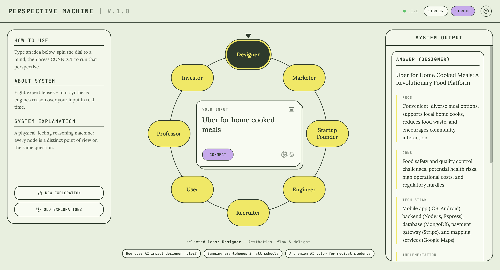

# Perspective Machine | V1.0 

A physical-feeling reasoning machine designed to stress-test ideas, products, and concepts through multiple dimensions. By simulating a rotary dial of eight expert agent lenses and processing them through four distinct synthesis engines, the Perspective Machine provides real-time, multi-angled critique and alignment for any input.

---

## Live Project Preview

Click the link below to experience the machine in real-time:

👉 **[perspective-machine-v1-0.vercel.app](https://perspective-machine-v1-0.vercel.app/)**

---

## Overview

The **Perspective Machine** breaks the echo chamber of traditional brainstorming. Instead of analyzing a concept from a single viewpoint, the system treats ideas as dynamic physical objects. Users feed a core prompt into the machine, "spin" the dial to distinct personas, and run deep-dive synthesis workflows to expose friction points, blind spots, and evolutionary paths.

---

## 🛠️ System Architecture

The core mechanics of the machine rely on a **8 + 4 Multi-Agent Framework**:

### 🎯 The 8 Expert Lenses
Every node on the rotary dial represents a distinct point of view on the exact same question:
*   **Designer:** Focuses on aesthetics, user flow, emotional resonance, and delight.
*   **Marketer:** Evaluates positioning, go-to-market strategy, acquisition loops, and messaging.
*   **Startup Founder:** Looks at execution velocity, resource constraints, scalability, and core unit economics.
*   **Engineer:** Analyzes technical feasibility, system architecture, data flow, and infrastructure limits.
*   **Recruiter:** Explores human capital requirements, culture fit, talent availability, and organizational design.
*   **User:** Represents the ground-truth customer friction, utility, willingness to pay, and day-to-day habits.
*   **Professor:** Provides academic framing, historical precedents, ethical considerations, and theoretical boundaries.
*   **Investor:** Targets total addressable market (TAM), defensibility, risk mitigation, and venture-scale return potential.

### ⚙️ The 4 Synthesis Engines
Located in the **System Output** panel, these engines run advanced cross-agent reasoning:
1.  **Consensus Engine:** Identifies areas of universal agreement across all active lenses.
2.  **Detect Blind Spots:** Pinpoints critical vulnerabilities or unaddressed market/technical realities that specific lenses missed.
3.  **Detect Perspective Conflicts:** Highlights ideological friction points (e.g., *Designer's aesthetic desires vs. Engineer's technical limitations*).
4.  **Trace Evolution Path:** Projects how the core idea must adapt over time based on the compounding feedback of all agents.

---

## 🕹️ How It Works

1.  **Input Your Idea:** Type your core concept or prompt into the centralized `YOUR INPUT` card (e.g., *"Uber for home-cooked meals"*).
2.  **Spin the Dial:** Click or rotate the interactive wheel to a specific node to load that expert's frame of reference.
3.  **Connect:** Press the `CONNECT` button to initialize the real-time reasoning stream for that specific lens.
4.  **Synthesize:** Use the right-hand panel to unlock meta-analysis tools (Consensus, Blind Spots, Conflicts, Evolution) to see how the viewpoints clash and combine.

---

## 🎨 UI & Design Language

The interface leverages a tactile-retro aesthetic designed to make digital reasoning feel tangible:
*   **Theme:** Mid-century minimalist industrial machinery.
*   **Palette:** Sage Green `#E2EAD9` (Base), Tactile Yellow (Active Nodes), and Cyber Violet (Action Targets).
*   **Typography:** Monospaced data displays combined with clean, high-legibility geometric sans-serif for contextual instructions.

---

## 🔮 Future Roadmap (V2.0)
*   **Custom Lens Hot-Swapping:** Allow users to build and inject their own custom agent personas into the wheel.
*   **Cross-Dial Weighting:** A slider mechanic to make certain expert voices "louder" than others during the synthesis phases.
*   **Exportable Briefs:** Generation of complete product specification documents compiled directly from the Synthesis Engines.
